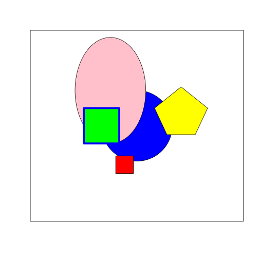

Blank "Canvases", Circles and Squares
======================================

```r
canvas <- function(mn = 0, mx = 100) {
    plot(1:2, ylim = c(mn, mx), xlim = c(mn, mx), asp = 1, xaxt = "n", yaxt = "n", 
        type = "n", xlab = "", ylab = "")
}

circle <- function(x, y, r, ry = r, ...) {
    angs <- seq(0, 2 * pi, length = 200)
    xpts <- x + r * cos(angs)
    ypts <- y + ry * sin(angs)
    polygon(xpts, ypts, ...)
}
```


```r
canvas()
circle(50, 50, 10, col = "blue", border = NULL)
circle(85, 65, 15, 30, col = "pink", border = "blue")
```

 

