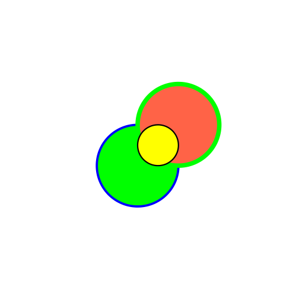
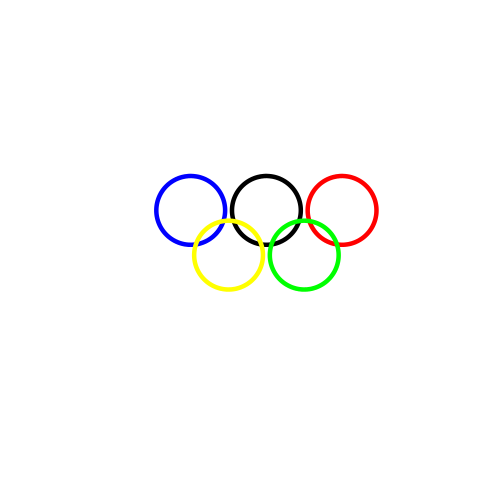

Functions and Graphics
=========================
## Sum of Numbers

```r
countOdds <- function(x) {
    sum(x%%2)
}

countOdds(1:9)
```

```
## [1] 5
```

```r

countEven <- function(x) {
    length(x) - countOdds(x)
}

countEven(1:9)
```

```
## [1] 4
```

```r

hypotenuseLength <- function(x, y) {
    sqrt(x^2 + y^2)
}
```

## Triangles
1. Finding the Hypotenuse Length

```r
hypotenuseLength(3, 4)
```

```
## [1] 5
```

```r

lawOfCosines <- function(a, b, theta) {
    sqrt(a^2 + b^2 - 2 * a * b * cos(theta))
}

lawOfCosines(13, 84, 0)
```

```
## [1] 71
```

```r

thetaFromLengths <- function(a, b, c) {
    acos((c^2 - a^2 - b^2)/(-2 * a * b))
}
thetaFromLengths(1, 2, 3)
```

```
## [1] 3.142
```

```r

thetaFromLengthsTest <- function(a, b, theta) {
    thetaFromLengths(a, b, lawOfCosines(a, b, theta)) - theta
}

thetaFromLengthsTest(13, 84, 0)
```

```
## [1] 0
```

## Graphics

```r
canvas <- function(mn = 0, mx = 100) {
    plot(1:2, ylim = c(mn, mx), xlim = c(mn, mx), asp = 1, xaxt = "n", yaxt = "n", 
        type = "n", bty = "n", xlab = "", ylab = "")
}

circle <- function(x, y, r, ry = r, ...) {
    angs <- seq(0, 2 * pi, length = 200)
    xpts <- x + r * cos(angs)
    ypts <- y + ry * sin(angs)
    polygon(xpts, ypts, ...)
}
```


Overlapping Circles

```r
canvas()
circle(40, 40, 20, col = "green", border = "blue", lwd = 5)
circle(60, 60, 20, col = "tomato", border = "green", lwd = 10)
circle(50, 50, 10, col = "yellow", border = "black", lwd = 3)
```

 


Olympic Rings

```r
canvas()
circle(50, 60, 10, col = "NA", border = "black", lwd = 6)
circle(28, 60, 10, col = "NA", border = "blue", lwd = 6)
circle(72, 60, 10, col = "NA", border = "red", lwd = 6)
circle(39, 47, 10, col = "NA", border = "yellow", lwd = 6)
circle(61, 47, 10, col = "NA", border = "green", lwd = 6)
```

 
