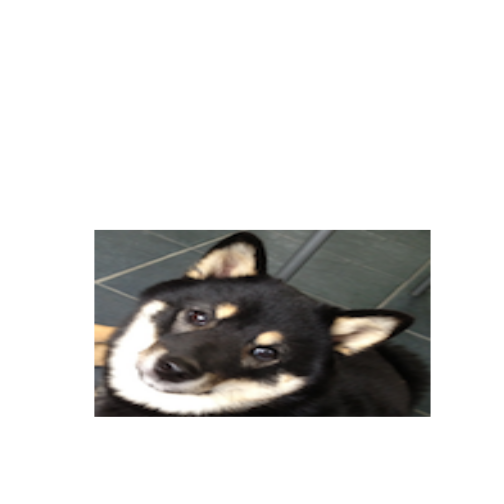

Starting with Images
==================================

```r
require(png)
```

```
## Loading required package: png
```

```r
require(RCurl)
```

```
## Loading required package: RCurl Loading required package: bitops
```

```r
puppy <- readPNG(getURLContent("http://dtkaplan.github.io/ScientificComputing/Resources/Images/mindo.png"))
COMP121::canvas(x = c(1, 220), y = c(1, 220), asp = 1)
graphics::rasterImage(puppy, 1, 1, 216, 198)
```

 

# Indexing, Cropping, and Expanding Images

## Cropping Tasks

### Mindo's Face

```r
require(png)
require(RCurl)
puppy <- readPNG(getURLContent("http://dtkaplan.github.io/ScientificComputing/Resources/Images/mindo.png"))
puppyface <- puppy[100:1120, 50:70, ]
```

```
## Error: subscript out of bounds
```

```r
COMP121::canvas(x = c(1, 220), y = c(1, 220), asp = 1)
```

 

```r
graphics::rasterImage(puppyface, 1, 1, 216, 198)
```

```
## Error: object 'puppyface' not found
```

