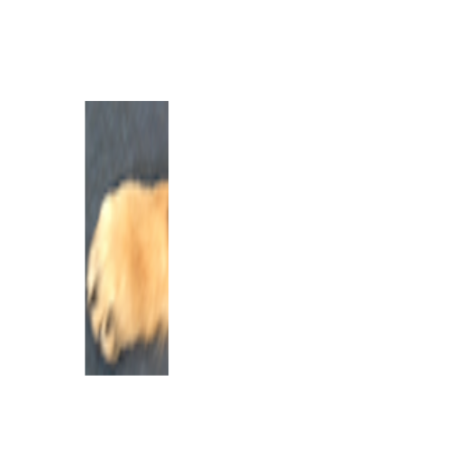
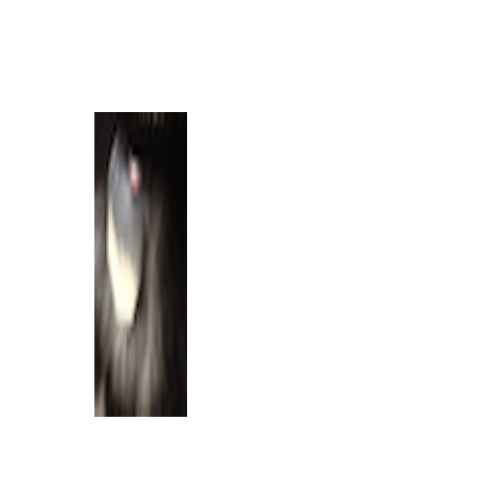

Starting with Images
==================================

```r
require(png)
```

```
## Loading required package: png
```

```r
require(RCurl)
```

```
## Loading required package: RCurl Loading required package: bitops
```

```r
puppy <- readPNG(getURLContent("http://dtkaplan.github.io/ScientificComputing/Resources/Images/mindo.png"))
COMP121::canvas(x = c(1, 220), y = c(1, 220), asp = 1)
graphics::rasterImage(puppy, 1, 1, 216, 198)
```

 

# Indexing, Cropping, and Expanding Images

## Cropping Tasks

### Mindo's Face

```r
require(png)
require(RCurl)
puppy <- readPNG(getURLContent("http://dtkaplan.github.io/ScientificComputing/Resources/Images/mindo.png"))
puppyface <- puppy[1:120, 85:215, ]
COMP121::canvas(x = c(1, 220), y = c(1, 220), asp = 1)
graphics::rasterImage(puppyface, 1, 1, 215, 120)
```

 


### Mindo's Left Front Paw

```r
puppypaw <- puppy[155:195, 1:60, ]
COMP121::canvas(x = c(1, 220), y = c(1, 220), asp = 1)
graphics::rasterImage(puppypaw, 1, 1, 60, 195)
```

 


### Mindo's Dog Tag

```r
puppydogtags <- puppy[120:145, 95:140, ]
COMP121::canvas(x = c(1, 220), y = c(1, 220), asp = 1)
graphics::rasterImage(puppydogtags, 1, 1, 60, 195)
```

 


### Intial Frame Tasking

```r
FrameImage <- function(image, FrameWidth) {
    
}
```
