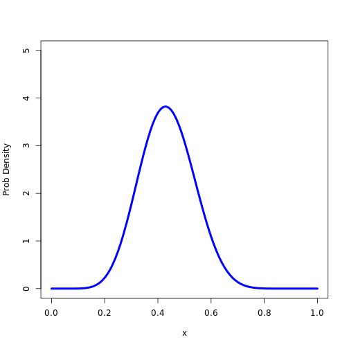

Toward a GUI about Likelihood
===================
packages

```r
require(manipulate)
```

```
## Loading required package: manipulate
```


# Example

```r
x <- seq(0, 1, length = 101)
plot(1:2, ylim = c(0, 5), xlim = c(0, 1), xlab = "x", ylab = "Prob Density", 
    type = "n")
lines(x, dbeta(x, 1, 2), lwd = 1)
lines(x, dbeta(x, 1, 4), lwd = 2)
lines(x, dbeta(x, 4, 2), lwd = 3)
```

 


# Beta Distribution Function

```r
BetaDistribution <- function(a, b, ...) {
    x <- seq(0, 1, length = 101)
    plot(1:2, ylim = c(0, 5), xlim = c(0, 1), xlab = "x", ylab = "Prob Density", 
        type = "n")
    lines(x, dbeta(x, a, b), ...)
}

BetaDistribution(10, 13, lwd = 4, col = "blue")
```

 


# Converting to Manipulate Application

```r
BetaApp <- function() {
    manipulate({
        BetaDistribution(a, b, lwd = c, col = color)
    }, a = slider(0, 10, initial = 1, label = "a", step = 0.1), b = slider(0, 
        10, initial = 2, label = "b", step = 0.1), c = slider(0, 20, initial = 1, 
        label = "Line Thickness", step = 1), color = picker(as.list(colors())))
}

BetaApp()
```

```
## Error: no such symbol rs_createUUID
```


